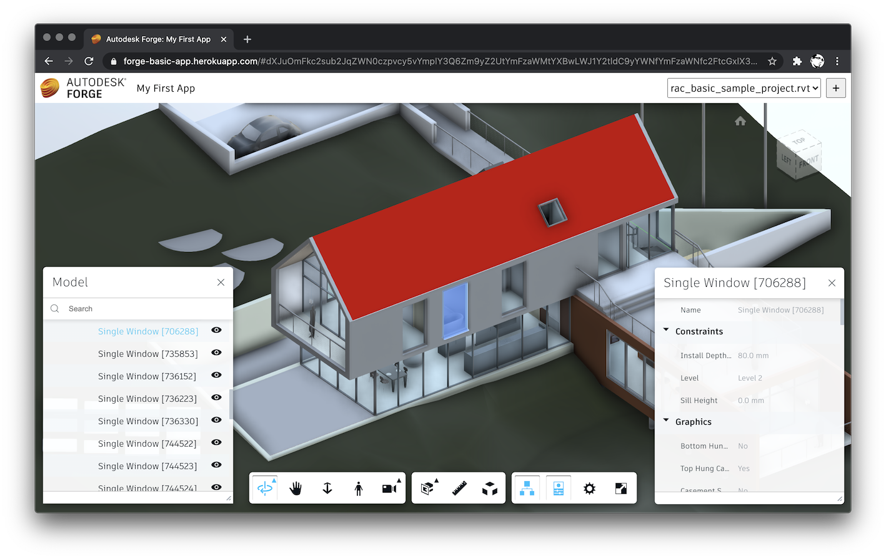

# forge-basic-app

Sample application showing the basic usage of [Autodesk Forge](https://forge.autodesk.com).

## Development

### Prerequisites

- [Register a Forge application](https://forge.autodesk.com/en/docs/oauth/v2/tutorials/create-app)
- [Node.js](https://nodejs.org) (we recommend the Long Term Support version)
- Terminal (for example, [Windows Command Prompt](https://en.wikipedia.org/wiki/Cmd.exe)
or [macOS Terminal](https://support.apple.com/guide/terminal/welcome/mac))

### Getting Started

- Clone the repository
- Create a copy of the _local.settings.template.json_ file in the root folder,
rename it to _local.settings.json_, and fill in the following settings:
    - `FORGE_CLIENT_ID` - Client ID of your Forge application
    - `FORGE_CLIENT_SECRET` - Client secret of your Forge application
    - `FORGE_BUCKET` - Name of a bucket in the Forge Data Management service where your designs are (or will be) stored
- Copy the _config.template.js_ file from the root folder into the _www_ subfolder,
rename it to _config.js_, and replace the `<Your Azure Function App URL>` placeholder in the script with the URL (without the trailing "/" character) of the Function app where the Azure Functions will be deployed
- Install dependencies: `npm install`