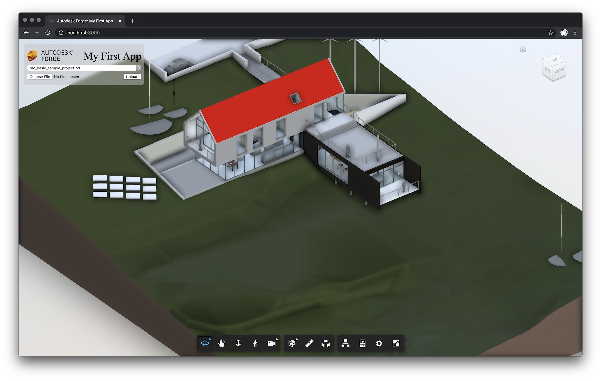

# forge-basic-app

Sample application showing the basic usage of [Autodesk Forge](https://forge.autodesk.com).



## Getting Started

- clone this repository
- install dependencies: `npm install` or `yarn install`
- setup environment variables
  - on macOS/linux:
    ```
    export FORGE_CLIENT_ID=<your client id>
    export FORGE_CLIENT_SECRET=<your client secret>
    export FORGE_BUCKET=<your bucket name>
    ```
  - on Windows:
    ```
    set FORGE_CLIENT_ID=<your client id>
    set FORGE_CLIENT_SECRET=<your client secret>
    set FORGE_BUCKET=<your bucket name>
    ```
- run the server: `node server.js`

If you're using [Visual Studio Code](https://code.visualstudio.com),
you can setup a launch task with all env. variables preconfigured:

```
{
    "version": "0.2.0",
    "configurations": [
        {
            "type": "node",
            "request": "launch",
            "name": "Launch Local Server",
            "program": "${workspaceFolder}/server.js",
            "env": {
                "FORGE_CLIENT_ID": "<your client id>",
                "FORGE_CLIENT_SECRET": "<your client secret>",
                "FORGE_BUCKET": "<your bucket name>"
            }
        }
    ]
}
```

[](https://heroku.com/deploy)
